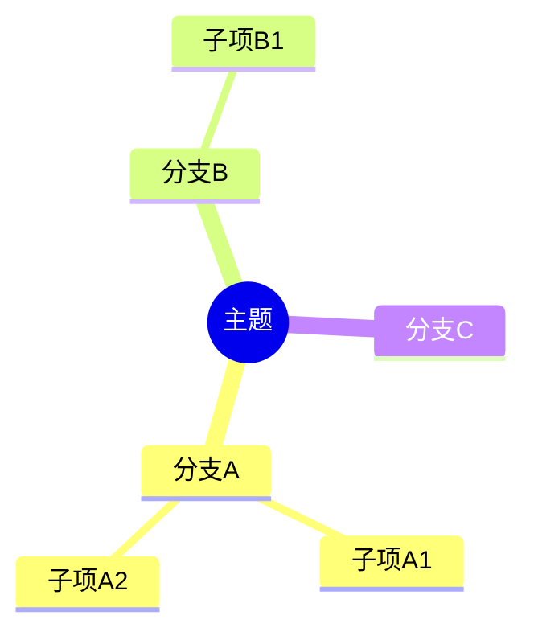
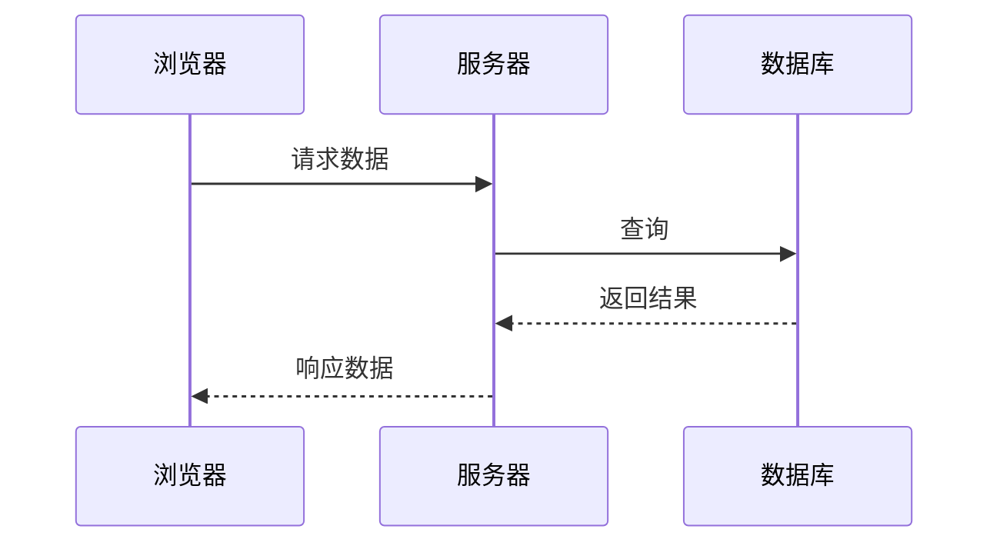
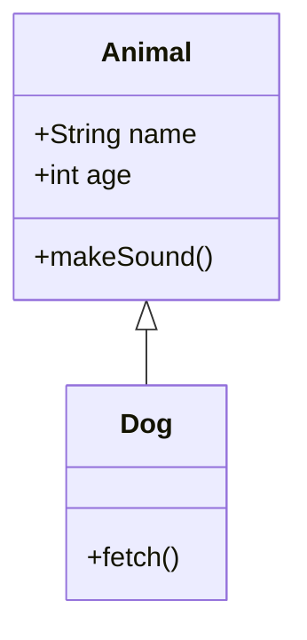
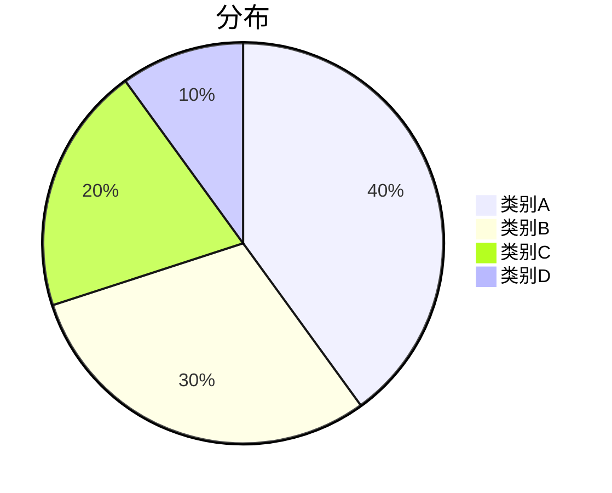
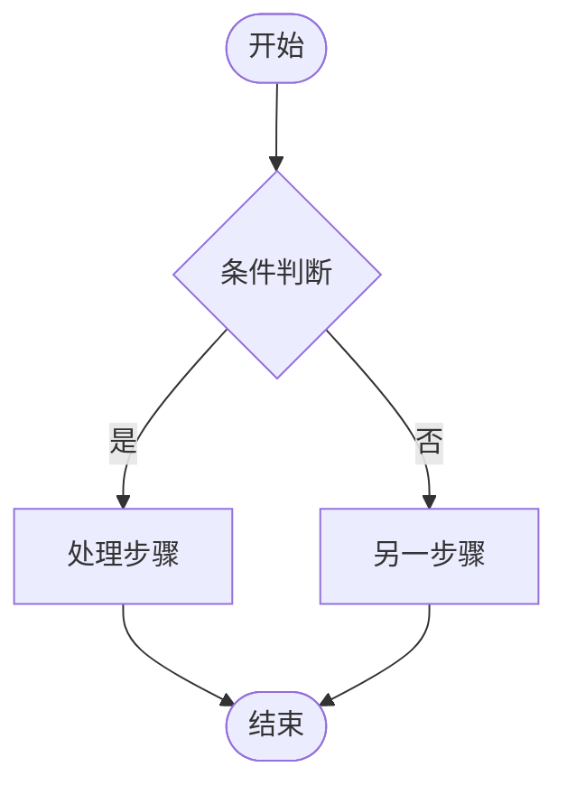
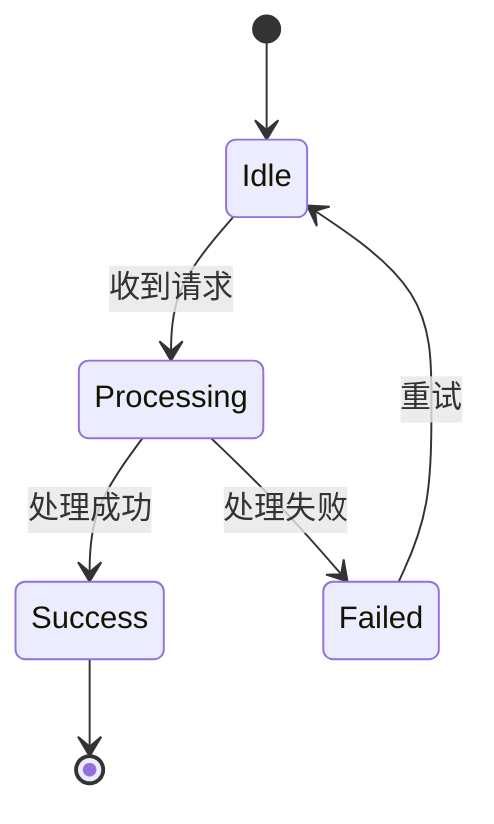

# Mermaid 图表路径

本场景与 DSL 路径互斥。

| | DSL 路径 | Mermaid 路径 |
|---|---|---|
| 中间格式 | JSON（WBDocument） | Mermaid 文本（.mmd 文件） |
| 布局控制 | 精确控制（x/y 坐标、Flex） | 由 parser-kit 自动布局 |
| 视觉定制 | 完全可控（颜色、字号、圆角等） | 有限（Mermaid 语法） |
| 参考模块 | references/ + 对应 scene | 仅本文件 |

## 适用条件

满足以下任一条件时使用：
- 用户明确要求 "用 Mermaid" 或 "输出 Mermaid"
- 用户直接粘贴了 Mermaid 语法文本
- 图表类型为思维导图、时序图、类图、饼图（自动路由）

## 思维导图 (Mindmap)

## 时序图 (Sequence Diagram)

消息类型：
- `->>` 实线箭头（同步请求）
- `-->>` 虚线箭头（响应/异步）
- `-x` 带 x 箭头（失败）

## 类图 (Class Diagram)

## 饼图 (Pie Chart)

## 流程图 (Flowchart)

> [!WARNING]
> **流程图不推荐使用 Mermaid 路径！**
> 带复杂分支、复合节点、高保真卡片样式的流程图应优先走 **DSL 路径**（参见 `scenes/flowchart.md`）。只有用户明确给出 Mermaid 代码，或场景本身就是极简文字流程时，才走此路径。

适用于：极简的文字节点判断业务流。

### 约束与规范

- **节点文字 ≤ 8 字**（超过必须缩写，必要时加图例说明）
- 判断节点（菱形）只写条件关键词，不写长描述
- 步骤数 ≤ 12（超过需合并步骤或拆分为子流程）
- 遵循标准流程图符号：开始/结束用体育场形状或圆形 `A([开始])`，判断用菱形 `B{判断}`，步骤用矩形 `C[步骤]`

### 语法参考

方向：`TD`（上到下）、`LR`（左到右）、`BT`（下到上）、`RL`（右到左）

节点形状：`A[矩形]`、`A(圆角)`、`A{菱形}`、`A((圆形))`、`A([体育场])`、`A[[子程序]]`

连线：`-->`（实线）、`-.->`（虚线）、`==>`（粗线）、`-->|标签|`（带标签）

## State Diagram

## 其他支持的图表类型

- **甘特图**：`gantt`
- **ER 图**：`erDiagram`
- **Git 分支图**：`gitGraph`

## 注意事项

- 输出纯 Mermaid 文本，不是 JSON，不要混用 DSL
- 节点文字含特殊字符时用双引号包裹：`A["包含(括号)的文字"]`
- `subgraph` 用于逻辑分组
- Mermaid 的流程图样式较基础，也无法在节点内部嵌套复杂排版；复杂流程优先走 DSL（见 `scenes/flowchart.md`），极简文字流程或用户显式给 Mermaid 代码时再使用 Mermaid。
